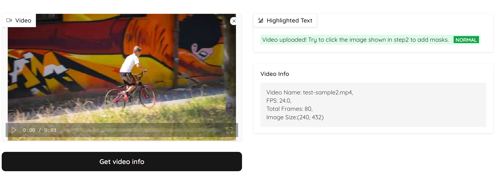
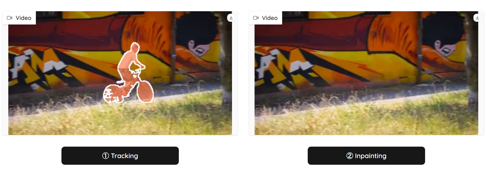

## Get Started
1. Install ProPainter Dependencies
You can follow the [Dependencies and Installation](https://github.com/Luo-Yihang/ProPainter-pr/tree/dev_yihang#dependencies-and-installation)

2. Install Demo Dependencies
```shell
cd web-demos/hugging_face

# install python dependencies 
pip3 install -r requirements.txt

# Run the demo
python app.py
```

## Usage Guidance
* Step 1: Upload your video and click the `Get video info` button.


* Step 2: 
   1. *[Optional]* Specify the tracking period for the currently added mask by dragging the `Track start frame` or `Track end frame`.
   2. Click the image on the left to select the mask area.
   3. - Click `Add mask` if you are satisfied with the mask, or
      - *[Optional]* Click `Clear clicks` if you want to reselect the mask area, or
      - *[Optional]* Click `Remove mask` to remove all masks.
   4. *[Optional]* Go back to step 2.1 to add another mask.

   
* Step 3: 
   1. Click the `Tracking` button to track the masks for the whole video.
   2. *[Optional]* Select the ProPainter parameters if the `ProPainter Parameters ` dropdown.
   2. Then click `Inpainting` to get the inpainting results.


*You can always refer to the `Highlighted Text` box on the page for guidance on the next step!*


## Citation
If you find our repo useful for your research, please consider citing our paper:
```bibtex
@inproceedings{zhou2023propainter,
   title={{ProPainter}: Improving Propagation and Transformer for Video Inpainting},
   author={Zhou, Shangchen and Li, Chongyi and Chan, Kelvin C.K and Loy, Chen Change},
   booktitle={Proceedings of IEEE International Conference on Computer Vision (ICCV)},
   year={2023}
}
```


## License

This project is licensed under <a rel="license" href="./LICENSE">NTU S-Lab License 1.0</a>. Redistribution and use should follow this license.


## Acknowledgements

The project harnesses the capabilities from [Track Anything](https://github.com/gaomingqi/Track-Anything), [Segment Anything](https://github.com/facebookresearch/segment-anything), [XMem](https://github.com/hkchengrex/XMem), and [E2FGVI](https://github.com/MCG-NKU/E2FGVI). Thanks for their awesome works.
